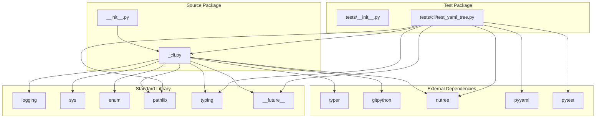

# Dependency Graph: git-tree-project-structure-to-yaml

## Overview

This document maps all import relationships in the git-tree-project-structure-to-yaml codebase, including both internal module dependencies and external package dependencies.

## Module Dependency Diagram

```
                            EXTERNAL DEPENDENCIES
    +----------------------------------------------------------------+
    |                                                                |
    |   typer          gitpython        nutree         stdlib        |
    |     |               |               |              |           |
    |     |          +----+----+     +----+----+    +----+----+      |
    |     |          |         |     |         |    |    |    |      |
    |     v          v         v     v         v    v    v    v      |
    |  [typer]    [Repo]  [Exc]   [Tree]  [Node] [logging] [sys]    |
    |                                              [enum]  [pathlib] |
    |                                              [typing]          |
    +----------------------------------------------------------------+
                               |
                               v
    +----------------------------------------------------------------+
    |                    SOURCE MODULES                              |
    |                                                                |
    |  +----------------------------------------------------------+ |
    |  |              __init__.py                                  | |
    |  |                                                           | |
    |  |  from ._cli import app as app                            | |
    |  +----------------------------------------------------------+ |
    |                           |                                    |
    |                           | imports                            |
    |                           v                                    |
    |  +----------------------------------------------------------+ |
    |  |                    _cli.py                                | |
    |  |                                                           | |
    |  |  STDLIB:                                                  | |
    |  |    - from __future__ import annotations                   | |
    |  |    - import logging                                       | |
    |  |    - import sys                                           | |
    |  |    - from enum import StrEnum, auto                       | |
    |  |    - from pathlib import Path                             | |
    |  |    - from typing import Annotated, TypeVar                | |
    |  |                                                           | |
    |  |  EXTERNAL:                                                | |
    |  |    - import typer                                         | |
    |  |    - from git import Repo                                 | |
    |  |    - from git.exc import InvalidGitRepositoryError,       | |
    |  |                         NoSuchPathError                   | |
    |  |    - from nutree import Node, Tree                        | |
    |  |                                                           | |
    |  |  EXPORTS:                                                 | |
    |  |    - app (Typer instance)                                 | |
    |  |    - main (CLI command)                                   | |
    |  |    - generate_yaml_output                                 | |
    |  |    - generate_tree_structure                              | |
    |  |    - build_tree_from_git                                  | |
    |  |    - path_node_formatter                                  | |
    |  |    - (and many helper functions)                          | |
    |  +----------------------------------------------------------+ |
    +----------------------------------------------------------------+
                               |
                               v
    +----------------------------------------------------------------+
    |                     TEST MODULES                               |
    |                                                                |
    |  +----------------------------------------------------------+ |
    |  |            tests/__init__.py                              | |
    |  |                                                           | |
    |  |  (empty - package marker only)                            | |
    |  +----------------------------------------------------------+ |
    |                                                                |
    |  +----------------------------------------------------------+ |
    |  |          tests/cli/test_yaml_tree.py                      | |
    |  |                                                           | |
    |  |  STDLIB:                                                  | |
    |  |    - from __future__ import annotations                   | |
    |  |    - from pathlib import Path                             | |
    |  |    - from typing import Any                               | |
    |  |                                                           | |
    |  |  EXTERNAL:                                                | |
    |  |    - import pytest                                        | |
    |  |    - import yaml                                          | |
    |  |    - from nutree import Tree                              | |
    |  |                                                           | |
    |  |  INTERNAL:                                                | |
    |  |    - from git_tree_project_structure_to_yaml._cli import  | |
    |  |        generate_yaml_output, path_node_formatter          | |
    |  +----------------------------------------------------------+ |
    +----------------------------------------------------------------+
```

## Mermaid Dependency Graph



## Detailed Import Analysis

### Source Module: `__init__.py`

**File**: `/src/git_tree_project_structure_to_yaml/__init__.py`

| Import Statement | Type | Purpose |
|-----------------|------|---------|
| `from __future__ import annotations` | Standard Library | Enable postponed evaluation of annotations |
| `from ._cli import app as app` | Internal | Re-export CLI application instance |

**Exports**: `app`

### Source Module: `_cli.py`

**File**: `/src/git_tree_project_structure_to_yaml/_cli.py`

#### Standard Library Imports

| Import Statement | Line | Symbols Used |
|-----------------|------|--------------|
| `from __future__ import annotations` | 30 | Postponed annotation evaluation |
| `import logging` | 32 | `logging.getLogger`, `logging.basicConfig`, `logging.DEBUG`, `logging.INFO` |
| `import sys` | 33 | `sys.stderr` |
| `from enum import StrEnum, auto` | 34 | `StrEnum`, `auto` |
| `from pathlib import Path` | 35 | `Path` (used extensively) |
| `from typing import Annotated, TypeVar` | 36 | `Annotated`, `TypeVar` |

#### External Package Imports

| Import Statement | Line | Package | Symbols Used |
|-----------------|------|---------|--------------|
| `import typer` | 38 | typer | `Typer`, `Argument`, `Option`, `Exit`, `echo` |
| `from git import Repo` | 39 | gitpython | `Repo` |
| `from git.exc import InvalidGitRepositoryError, NoSuchPathError` | 40 | gitpython | Exception classes |
| `from nutree import Node, Tree` | 41 | nutree | `Node`, `Tree` |

**Exports** (Public API):
- `app` - Typer application instance
- `main` - CLI command function
- `IndentType` - Enum for indentation types
- `OutputFormat` - Enum for output formats
- `build_ls_files_args` - Git command argument builder
- `resolve_repo_paths` - Path resolution helper
- `validate_directories` - Directory validation helper
- `generate_output_content` - Output format handler
- All other helper functions (implicitly public)

### Test Module: `test_yaml_tree.py`

**File**: `/tests/cli/test_yaml_tree.py`

#### Standard Library Imports

| Import Statement | Line | Symbols Used |
|-----------------|------|--------------|
| `from __future__ import annotations` | 1 | Postponed annotation evaluation |
| `from pathlib import Path` | 3 | `Path` |
| `from typing import Any` | 4 | `Any` |

#### External Package Imports

| Import Statement | Line | Package | Symbols Used |
|-----------------|------|---------|--------------|
| `import pytest` | 6 | pytest | `pytest.fixture`, `pytest.MonkeyPatch`, `pytest.fail` |
| `import yaml` | 7 | pyyaml | `yaml.safe_load`, `yaml.YAMLError` |
| `from nutree import Tree` | 8 | nutree | `Tree` |

#### Internal Package Imports

| Import Statement | Line | Source Module | Symbols Used |
|-----------------|------|---------------|--------------|
| `from git_tree_project_structure_to_yaml._cli import generate_yaml_output, path_node_formatter` | 10 | `_cli.py` | `generate_yaml_output`, `path_node_formatter` |

## External Dependency Details

### Runtime Dependencies (from pyproject.toml)

| Package | Version | Used In | Purpose |
|---------|---------|---------|---------|
| `gitpython` | >=3.1.44 | `_cli.py` | Git repository interaction |
| `nutree` | >=1.1.0 | `_cli.py`, tests | Tree data structure |
| `typer` | >=0.15.4 | `_cli.py` | CLI framework |
| `pyyaml` | >=6.0.2 | tests only | YAML parsing for test validation |
| `types-pyyaml` | >=6.0.12.20250516 | Type checking | Type stubs for pyyaml |

### Development Dependencies

| Package | Version | Purpose |
|---------|---------|---------|
| `pytest` | >=8.3.5 | Testing framework |
| `pytest-cov` | >=6.1.1 | Test coverage |
| `mypy` | >=1.19.0 | Static type checking |
| `ruff` | >=0.14.0 | Linting and formatting |
| `inline-snapshot` | >=0.23.0 | Snapshot testing |
| `ty` | >=0.0.1a5 | Type checking tool |

## Circular Dependency Analysis

**Result**: No circular dependencies detected.

The dependency flow is strictly hierarchical:

```
tests/cli/test_yaml_tree.py
           |
           v
git_tree_project_structure_to_yaml/__init__.py
           |
           v
git_tree_project_structure_to_yaml/_cli.py
           |
           v
    External packages (typer, gitpython, nutree)
```

## Dynamic Import Analysis

**Search performed for**: `getattr`, `importlib`, `__import__`, `eval`, `exec`

**Result**: No dynamic imports found in the codebase.

The only occurrence of `getattr` is in a documentation comment:
- `_cli.py:134` - Comment explaining eager evaluation of `next()` defaults

## Import Health Summary

| Metric | Value | Status |
|--------|-------|--------|
| Circular dependencies | 0 | Good |
| Dynamic imports | 0 | Good |
| Unused declared dependencies | 0 | Resolved |
| Test-only runtime dependencies | 1 (pyyaml) | Consider moving to dev |
| Internal module coupling | Low | Good |

## Recommendations

1. ~~**Remove unused dependencies**: `packaging` and `pydantic` are declared but never used.~~ - COMPLETED

2. **Consider moving `pyyaml` to dev dependencies**: It's only used in tests for YAML validation.

3. **Improve module structure**: Currently `_cli.py` imports all external dependencies. Splitting into multiple modules would create clearer dependency boundaries:
   - `git_utils.py` would depend on `gitpython`
   - `formatters.py` would depend on `nutree`
   - `cli.py` would depend on `typer`

4. **Add `__all__` to `_cli.py`**: The `__init__.py` now has `__all__` defined, but `_cli.py` itself lacks an explicit public API definition which could lead to unintended coupling.
